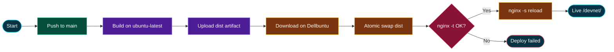

# DevNet Deployment

DevNet is a static Vite SPA. Production deploys via **GitHub Actions**: build on `ubuntu-latest`, then sync artifacts to a **self-hosted runner** (Dellbuntu / home Nginx) and serve under the path **`/devnet/`**.

**Live URL:** [https://launch.giangnt.dev/devnet/](https://launch.giangnt.dev/devnet/)

## Diagram

Open the interactive diagram (export to PNG/PDF via the ⋯ menu):

**[deployment-flow.html](deployment-flow.html)**



## How it works

| Piece | Detail |
| --- | --- |
| Trigger | Push to `main`, or manual **workflow_dispatch** |
| Workflow | [`.github/workflows/deploy.yml`](../.github/workflows/deploy.yml) |
| Project name | `devnet` (`PROJECT_NAME`) |
| Origin host | `launch.giangnt.dev` (`ORIGIN_SERVER_NAME`) |
| App base path | `/devnet/` (`vite.config.ts` `base`, `App.tsx` `basename`) |
| Nginx style | **Modular** include (`infra/nginx/modular.conf`) — not standalone |
| Infra root | [`infra/nginx/`](../infra/nginx/) |

### Job 1 — `build-frontend` (`ubuntu-latest`)

1. Checkout + Node 20 (npm cache enabled by default)
2. `npm ci --legacy-peer-deps` and `npm run build` → `dist/`
3. Copy `infra/nginx/modular.conf` → `dist/nginx.modular.conf`, substitute `${PROJECT_NAME}`
4. Upload artifact `devnet-dist`

**Force a cold npm install** (bypass cache): Actions → this workflow → **Run workflow** → enable *Bypass npm cache and run a cold install*.

### Job 2 — `deploy-frontend` (self-hosted: `home`, `dellbuntu`)

Runs only after a successful build.

1. Download `devnet-dist` into `dist/`
2. Ensure `/var/www/devnet` exists and is owned by `gh-runner`
3. Stage to `/var/www/devnet/dist.next`, install Nginx snippet, `nginx -t`, then atomic swap to `dist`
4. `sudo nginx -s reload` (other sites on the host keep serving)
5. Remove `dist.prev` and clean runner-local `dist/`

### What Nginx serves

From `infra/nginx/modular.conf` (after substitution):

- `location /devnet/` → alias `/var/www/devnet/dist/` with SPA `try_files` fallback
- `location = /devnet` → `301` redirect to `/devnet/`

The site is path-mounted on the shared host. `infra/nginx/standalone.conf` is a root-vhost template for a future standalone deploy.

## Prerequisites (server)

- Self-hosted GitHub Actions runner with labels `self-hosted`, `home`, `dellbuntu`
- User `gh-runner` with **passwordless sudo** (needed for Nginx include path, `nginx -t`, reload):

  ```text
  gh-runner ALL=(ALL) NOPASSWD: ALL
  ```

  (As noted in the workflow; tighten later if desired.)

- Nginx already includes configs from `/etc/nginx/includes/projects/` (or equivalent)

## Local build / preview

```sh
npm run build
npm run preview
```

Output is in `dist/`. Production path routing uses Vite `base` `/devnet/` (already set).

## Backend note

There is no app server in this pipeline. Auth and data stay on **Supabase**. Nginx only serves static files; API proxy blocks in `infra/nginx/standalone.conf` remain commented out.

## Related files

| File | Role |
| --- | --- |
| `.github/workflows/deploy.yml` | CI/CD pipeline |
| `infra/nginx/modular.conf` | Path-mounted Nginx snippet (active) |
| `infra/nginx/standalone.conf` | Standalone vhost template (unused by current job) |
| `vite.config.ts` | `base: "/devnet/"` |
| `src/App.tsx` | `BrowserRouter basename="/devnet"` |
| `docs/deployment-flow.html` | Visual process diagram |
