# DevNet Deployment

DevNet runs as a **Docker Compose** stack on a dedicated bridge network named **`devnet`**: PostgreSQL, Redis, a scalable Fastify API, and an edge Nginx that serves the SPA and proxies `/devnet/api`. The host Nginx on `launch.giangnt.dev` only reverse-proxies `/devnet/` to the edge container on loopback.

**Live URL:** [https://launch.giangnt.dev/devnet/](https://launch.giangnt.dev/devnet/)

## Diagrams

- Deploy process: **[deployment-flow.html](deployment-flow.html)**
- System design: **[system-design.html](system-design.html)**

```mermaid
flowchart LR
  A([Start]) --> B[Push to main]
  B --> C[Checkout on Dellbuntu]
  C --> D[rsync to /var/www/devnet]
  D --> E[docker compose up --build]
  E --> F[Install host Nginx include]
  F --> G{nginx -t OK?}
  G -->|Yes| H[nginx -s reload]
  G -->|No| X([Deploy failed])
  H --> I[Health check]
  I --> Z([Live /devnet/])

  style A fill:#083344,stroke:#22d3ee,color:#fff
  style Z fill:#083344,stroke:#22d3ee,color:#fff
  style X fill:#083344,stroke:#fb7185,color:#fff
  style B fill:#064e3b,stroke:#34d399,color:#fff
  style C fill:#78350f,stroke:#fbbf24,color:#fff
  style D fill:#78350f,stroke:#fbbf24,color:#fff
  style E fill:#4c1d95,stroke:#a78bfa,color:#fff
  style F fill:#78350f,stroke:#fbbf24,color:#fff
  style H fill:#78350f,stroke:#fbbf24,color:#fff
  style I fill:#4c1d95,stroke:#a78bfa,color:#fff
  style G fill:#881337,stroke:#fb7185,color:#fff
```



## How it works

| Piece | Detail |
| --- | --- |
| Trigger | Push to `main`, or manual **workflow_dispatch** |
| Workflow | [`.github/workflows/deploy.yml`](../.github/workflows/deploy.yml) |
| Project name | `devnet` |
| Compose network | `devnet` (bridge) |
| Edge bind | `127.0.0.1:${EDGE_PORT}` (default `8088`) |
| App base path | `/devnet/` (`vite.config.ts` `base`, `App.tsx` `basename`) |
| Host Nginx | Proxies `/devnet/` → edge ([`infra/nginx/modular.conf`](../infra/nginx/modular.conf)) |

### Job — `deploy` (self-hosted: `home`, `dellbuntu`)

1. Checkout repository
2. Rsync into `/var/www/devnet/src` (excludes `.env`, `node_modules`)
3. Require `/var/www/devnet/.env` (copy into compose project dir)
4. `docker compose up -d --build --remove-orphans`
5. Substitute and install host Nginx include, `nginx -t`, reload
6. Curl edge `/healthz` and `/devnet/api/health`

### Compose services

| Service | Role | Ports |
| --- | --- | --- |
| `postgres` | PostgreSQL 16 | internal only |
| `redis` | Sessions + cache | internal only |
| `api` | Fastify API (scaleable) | `127.0.0.1:4000` (local Vite) |
| `edge` | SPA + `/devnet/api` proxy | `127.0.0.1:${EDGE_PORT}` |

Scale API replicas (edge uses Docker DNS `resolver 127.0.0.11`):

```sh
cd /var/www/devnet/src
docker compose up -d --scale api=3
```

Postgres and Redis stay single instances with named volumes.

## Prerequisites (server)

- Self-hosted GitHub Actions runner with labels `self-hosted`, `home`, `dellbuntu`
- Docker Engine + Docker Compose plugin
- Passwordless sudo for `gh-runner` (Nginx include path, `nginx -t`, reload)
- One-time secrets file:

  ```sh
  sudo mkdir -p /var/www/devnet
  sudo chown gh-runner:gh-runner /var/www/devnet
  cp /path/to/repo/.env.example /var/www/devnet/.env
  # edit JWT_SECRET, POSTGRES_PASSWORD, ADMIN_*, EDGE_PORT
  ```

## Local stack

```sh
cp .env.example .env
docker compose up -d --build
```

Open [http://127.0.0.1:8088/devnet/](http://127.0.0.1:8088/devnet/).

For SPA hot reload: keep Compose up and run `npm run dev` (Vite proxies `/devnet/api` → `:4000`).

## Related files

| File | Role |
| --- | --- |
| `docker-compose.yml` | Stack definition |
| `.github/workflows/deploy.yml` | CI/CD |
| `infra/nginx/edge.conf` | In-compose edge Nginx |
| `infra/nginx/modular.conf` | Host path-mount proxy |
| `infra/nginx/standalone.conf` | Standalone vhost proxy template |
| `server/` | Fastify API + SQL migrations |
| `docs/system-design.html` | Architecture diagram |
| `docs/deployment-flow.html` | Deploy process diagram |
